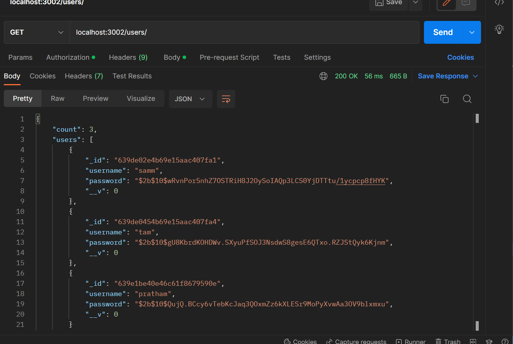

# RestApi Tutorial
This repo contains some basic apis which does the following functionalities -
- Authenticate user with JWT token 
- Use multer to input csv file and sstores it into mongodb

## How to setup
1. Clone the project by <br>
```
git clone https://github.com/Pratham-19/restapi.git
```
2. Make an env file and add your mongodb and jwt_secret_key
```
//In .env
PORT = 'Any Port...' 
MONGO_ATLAS_PW= 'Your Mongodb Key...' 
JWT_KEY = 'Your jwt private key...'
```
3. Install packages
```
npm install
```
3. Run server
```
npm start 
```

## Functionalities
### 1. Authentication


1.1 Creating new User using bcrpyt <br>


1.2 Login with help of bcrpyt & jwt  <br>


> Entering wrong password


1.3 Authenticating (valid for 1h can change in code ) <br>


1.4 See all users (only authenticated users can see)  <br>




1.4 Delete user (Authentication required) <br>


### 2. File fetch

2.1 Uplaoding file and stroing the results in mongodb with email and linkein validation using regex (only authenticated users)  <br>


> In database


